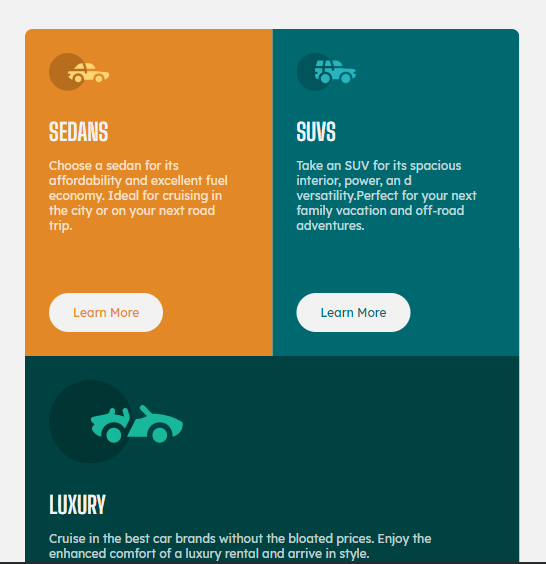

# Frontend Mentor - 3-column preview card component solution

This is a solution to the [3-column preview card component challenge on Frontend Mentor](https://www.frontendmentor.io/challenges/3column-preview-card-component-pH92eAR2-). Frontend Mentor challenges help you improve your coding skills by building realistic projects.

## Table of contents

- [Overview](#overview)
  - [The challenge](#the-challenge)
  - [Screenshot](#screenshot)
  - [Links](#links)
  - [Built with](#built-with)
  - [Useful resources](#useful-resources)
- [Author](#author)

## Overview

### The challenge

Users should be able to:

- View the optimal layout depending on their device's screen size
- See hover states for interactive elements

### Screenshot

### Links

- Solution URL: [Challenge web site](https://www.frontendmentor.io/solutions/3column-preview-card-component-flexbox-bem-responsive-GY8n2AziL)
- Live Site URL: [github pages live ](https://brkcln.github.io/3-column-preview-card-component-main)

### Built with

- Semantic HTML5 markup
- Flexbox
- BEM

### Useful resources

- [stackoverflow](https://stackoverflow.com/)
- [MDN web doc](https://developer.mozilla.org/)
- [Csstricks](https://css-tricks.com)

## Author

- Website - [@brkcln](https://brkcln.github.io/brkcln)
- Frontend Mentor - [@brkcln](https://www.frontendmentor.io/profile/brkcln)
- Github - [@brkcln](https://github.com/brkcln)
